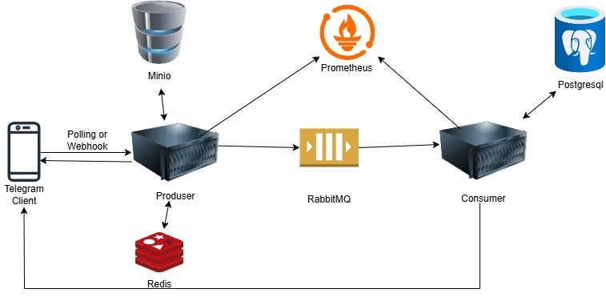
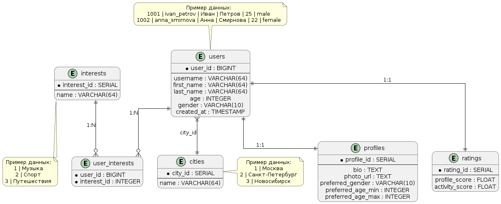

# **Описание сервисов Dating Bot**

## 🏗 **Архитектура Telegram-бота**

### 📱 **Клиентская часть**

- **Telegram Client** - мобильное приложение пользователя.
- **Polling/Webhook** - механизм получения обновлений от Telegram.

### 🖥 **Серверная часть (Producer)**

- **Основной сервер**:
  - Принимает запросы от Telegram.
  - Обрабатывает команды пользователей.
  - Формирует ответы.

### 🗄 **Хранение данных**

- **PostgreSQL** - основная база данных.
- **Minio (S3-совместимое хранилище)** - хранение медиа (фото, видео).
- **Redis**:
  - Кэширование частых запросов.
  - Хранение временных данных (сессии, состояния).

### 🔄 **Асинхронная обработка (Consumer)**

- **RabbitMQ** - очередь сообщений для:
  - Долгих операций
  - Взаимодействие с консюмером
  - Для безперебойной работы бота
- **Consumer-сервер** - обработка задач из очереди.

### 🔔 **Обработка Фоновых задачь (Celery)**

### 📊 **Мониторинг**

- **Prometheus** - сбор метрик:
  - Производительность
  - Ошибки
  - Нагрузка



### **Основные компоненты:**

1. **Frontend** → Telegram Bot (`aiogram`).
2. **Backend Services** → FastAPI (RESTful API).
3. **Database** → PostgreSQL (основные данные) + Redis (кэш).
4. **Storage** → MinIO (S3-совместимое хранилище для фото).
5. **Message Broker** → RabbitMQ (для событий: лайки, пропуски, мэтчи).
6. **Celery** → Фоновые задачи (пересчет рейтинга, очистка кэша).

---



---

## PostgreSQL Таблицы с демонстрационными данными

### Создание таблиц

```sql
-- Создаем таблицу городов
CREATE TABLE cities (
    city_id SERIAL PRIMARY KEY,
    name VARCHAR(64) NOT NULL UNIQUE
);

-- Создаем таблицу пользователей
CREATE TABLE users (
    user_id BIGINT PRIMARY KEY,
    username VARCHAR(64) UNIQUE,
    first_name VARCHAR(64) NOT NULL,
    age INTEGER CHECK (age >= 18),
    gender VARCHAR(10) CHECK (gender IN ('male', 'female', 'other')),
    city_id INTEGER REFERENCES cities(city_id),
    created_at TIMESTAMP DEFAULT NOW()
);

-- Создаем таблицу интересов
CREATE TABLE interests (
    interest_id SERIAL PRIMARY KEY,
    name VARCHAR(64) NOT NULL UNIQUE
);

-- Создаем таблицу связей пользователей и интересов
CREATE TABLE user_interests (
    user_id BIGINT REFERENCES users(user_id) ON DELETE CASCADE,
    interest_id INTEGER REFERENCES interests(interest_id) ON DELETE CASCADE,
    PRIMARY KEY (user_id, interest_id)
);

-- Создаем таблицу профилей
CREATE TABLE profiles (
    profile_id SERIAL PRIMARY KEY,
    user_id BIGINT REFERENCES users(user_id) ON DELETE CASCADE UNIQUE,
    bio TEXT,
    photo_url TEXT,
    preferred_gender VARCHAR(10) CHECK (preferred_gender IN ('male', 'female', 'other')),
    preferred_age_min INTEGER CHECK (preferred_age_min >= 18),
    preferred_age_max INTEGER CHECK (preferred_age_max >= preferred_age_min)
);

-- Создаем таблицу рейтингов
CREATE TABLE ratings (
    rating_id SERIAL PRIMARY KEY,
    user_id BIGINT REFERENCES users(user_id) ON DELETE CASCADE UNIQUE,
    profile_score FLOAT DEFAULT 0 CHECK (profile_score BETWEEN 0 AND 10),
    activity_score FLOAT DEFAULT 0 CHECK (activity_score BETWEEN 0 AND 10)
);
```

### Вставка демонстрационных данных

```sql
-- Добавляем города
INSERT INTO cities (name) VALUES
('Москва'),
('Санкт-Петербург'),
('Новосибирск'),
('Екатеринбург'),
('Казань');

-- Добавляем интересы
INSERT INTO interests (name) VALUES
('Музыка'),
('Спорт'),
('Путешествия'),
('Кино'),
('Программирование'),
('Фотография'),
('Кулинария');

-- Добавляем пользователей
INSERT INTO users (user_id, username, first_name, last_name, age, gender, city_id) VALUES
(1001, 'ivan_petrov', 'Иван', 'Петров', 25, 'male', 1),
(1002, 'anna_smirnova', 'Анна', 'Смирнова', 22, 'female', 2),
(1003, 'alex_volkov', 'Алексей', 'Волков', 30, 'male', 1),
(1004, 'elena_kuz', 'Елена', 'Кузнецова', 28, 'female', 3),
(1005, 'max_ivanov', 'Максим', 'Иванов', 19, 'male', 4);

-- Добавляем связи пользователей с интересами
INSERT INTO user_interests (user_id, interest_id) VALUES
(1001, 1), (1001, 3), (1001, 5),  -- Иван: музыка, путешествия, программирование
(1002, 2), (1002, 4), (1002, 7),  -- Анна: спорт, кино, кулинария
(1003, 1), (1003, 2), (1003, 6),  -- Алексей: музыка, спорт, фотография
(1004, 3), (1004, 5), (1004, 7),  -- Елена: путешествия, программирование, кулинария
(1005, 2), (1005, 4), (1005, 6);  -- Максим: спорт, кино, фотография

-- Добавляем профили
INSERT INTO profiles (user_id, bio, photo_url, preferred_gender, preferred_age_min, preferred_age_max) VALUES
(1001, 'Люблю путешествовать и программировать', 'https://storage.example.com/1001.jpg', 'female', 20, 30),
(1002, 'Профессионально занимаюсь теннисом', 'https://storage.example.com/1002.jpg', 'male', 22, 35),
(1003, 'Фотограф и музыкант', 'https://storage.example.com/1003.jpg', 'female', 25, 40),
(1004, 'Работаю в IT, мечтаю объездить весь мир', 'https://storage.example.com/1004.jpg', 'male', 25, 35),
(1005, 'Студент, увлекаюсь спортом', 'https://storage.example.com/1005.jpg', 'female', 18, 25);

-- Добавляем рейтинги
INSERT INTO ratings (user_id, profile_score, activity_score) VALUES
(1001, 8.5, 7.2),
(1002, 9.1, 8.7),
(1003, 7.8, 6.5),
(1004, 8.9, 7.8),
(1005, 6.5, 5.3);
```

### Примеры запросов

1. **Получить всех пользователей из Москвы:**

```sql
SELECT u.user_id, u.first_name, u.last_name, c.name as city
FROM users u
JOIN cities c ON u.city_id = c.city_id
WHERE c.name = 'Москва';
```

2. **Найти пользователей с интересом "Путешествия":**

```sql
SELECT u.user_id, u.first_name, u.last_name
FROM users u
JOIN user_interests ui ON u.user_id = ui.user_id
JOIN interests i ON ui.interest_id = i.interest_id
WHERE i.name = 'Путешествия';
```

3. **Получить полную информацию о пользователе (включая профиль и рейтинг):**

```sql
SELECT
    u.user_id,
    u.first_name,
    u.age,
    c.name as city,
    p.bio,
    p.photo_url,
    r.profile_score,
    r.activity_score
FROM users u
JOIN cities c ON u.city_id = c.city_id
JOIN profiles p ON u.user_id = p.user_id
JOIN ratings r ON u.user_id = r.user_id
WHERE u.user_id = 1001;
```

4. **Найти совместимые пары для конкретного пользователя:**

```sql
-- Для пользователя с ID 1001 (Иван)
SELECT
    u.user_id,
    u.first_name,
    u.age,
    p.bio,
    r.profile_score + r.activity_score as total_score
FROM users u
JOIN profiles p ON u.user_id = p.user_id
JOIN ratings r ON u.user_id = r.user_id
WHERE
    u.gender = (SELECT preferred_gender FROM profiles WHERE user_id = 1001)
    AND u.age BETWEEN (SELECT preferred_age_min FROM profiles WHERE user_id = 1001)
                  AND (SELECT preferred_age_max FROM profiles WHERE user_id = 1001)
    AND u.user_id != 1001
ORDER BY total_score DESC;
```
